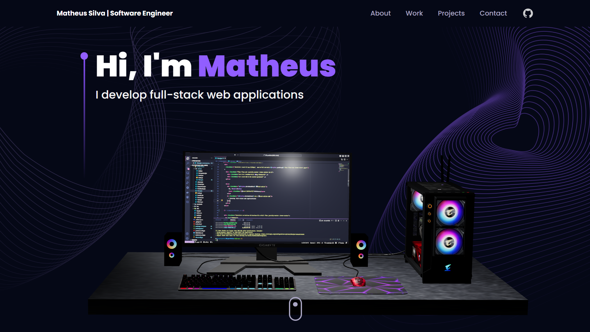

# 
Hi, I'm Matheus Silva! 👋

- 🎓 Computer Science student at UNIFESP  
- 👨‍💻 Software Engineer  
- 📚 Acquiring knowledge is an addiction for me  
- 🌍 Passionate about exploring new technologies and their impact on the world  
- 🤖 Intrigued by the possibilities of AI, always curious to explore its capabilities

 

## Tech Stack 💻 

| Frameworks | Databases | Programming Languages | Tools and Technologies |
|---|---|---|---|
| 

 | 

 | 

 | 

 |
| 

 | 

 | 

 | 

 |
| 

 | | 

 | 

 |
| 

 || 

 | 

 |

## 
GitHub Stats 📊

  

  

## 
Contact Me 📧

  
  
  

## 
Portfolio ⭐

  

